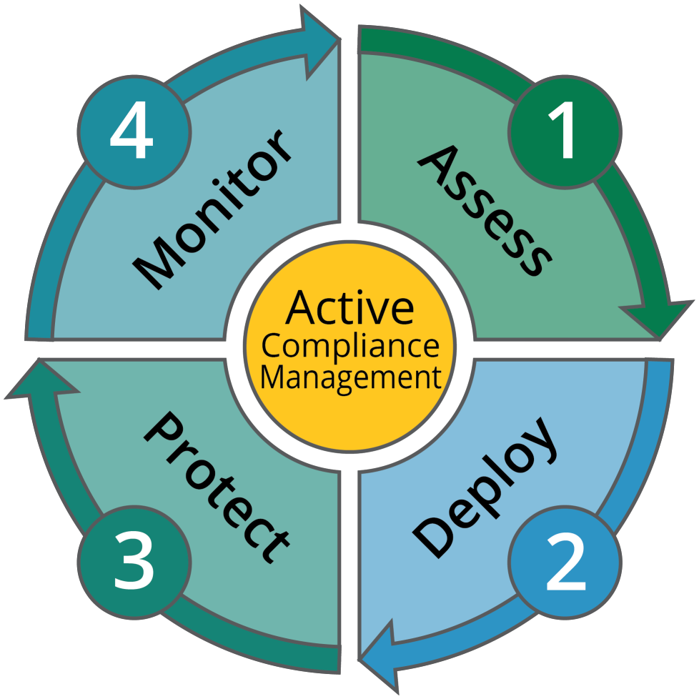

# Security & Compliance Automation Jobs

**This project implements a k8s CronJob**
**The cronjob is usefull for triggering various compliance automation scripts**

## 1. AWS Credentials module: 'aws_iam'   
The Following scripts produce a daily emailed report of the state of AWS console and CLI Access key credentials:

- [aws_access_keys](./scripts.d/aws_iam/aws_access_key.py) implements a scan and report of the aging of AWS CLI access keys.     
- [aws_console_password](./scripts.d/aws_iam/aws_console_passwords.py) implements a scan and report of AWS Console login passwords.    

#### Usage:
- This software is provisioned via a Kubernetes Helm Chart.    
- Deploy this as follows:   
'cd' to the .\chart\acme-compliance-jobs  directory.     

**Extend this package by:**
- a. adding scripts to the .\scripts.d directory.
- b. add an entry-point for your script in the .\scripts.d\handler.py script.
- c. run the following commands to update the container image:     

```sh
$ make && make push   
```

**To install this on a cluster**    
'cd" to the ./deploy/k8s directory.    
Run the following command:     
```sh
$ kubectl create -f deploy.yml 
```   

Validate with:
```sh
$ kubectl get CronJobs
```

**To clean up/Remove this CronJob**     
'cd" to the ./deploy/k8s directory.    
Run the following command:    
```sh
$ kubectl delete -f deploy.yml 
```

## Cron syntax

```pseudo
cron(Minutes Hours Day-of-month Month Day-of-week Year)
```

All fields are required and time zone is UTC only.

| Field         | Values         | Wildcards     |
| ------------- |:--------------:|:-------------:|
| Minutes       | 0-59           | , - * /       |
| Hours         | 0-23           | , - * /       |
| Day-of-month  | 1-31           | , - * ? / L W |
| Month         | 1-12 or JAN-DEC| , - * /       |
| Day-of-week   | 1-7 or SUN-SAT | , - * ? / L # |
| Year          | 192199      | , - * /       |

Read the [k8s cron-jobs](https://kubernetes.io/docs/concepts/workloads/controllers/cron-jobs/#schedule) docs for more info on how to setup cron


    

---
2019 - Acme Infrastructure Security Team
